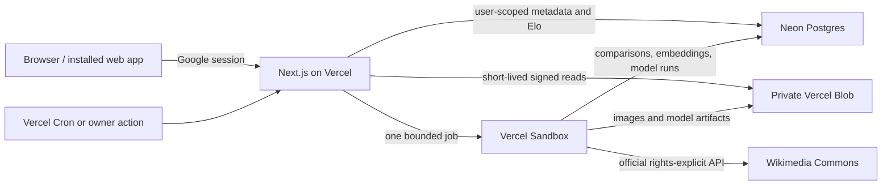

# Lumen / Image Ranker

Lumen is a private, single-owner photography taste engine. Compare two photographs, maintain a live Elo collection, train a personal pairwise vision model from your choices, and let that model discover licensed high-resolution work you are likely to value.

The primary product is a responsive Next.js application hosted on Vercel. Google sign-in protects the collection, Neon Postgres stores rankings and model state, private Vercel Blob stores photographs, and bounded Vercel Sandbox jobs crawl and retrain without requiring a Mac to stay online.

The public repository contains only code and documentation. Photographs, comparisons, rankings, embeddings, and trained model artifacts live in the deployer's private cloud resources and never belong in Git.

## Product

- Side-by-side, full-screen comparison on desktop and mobile.
- Arrow keys choose focus, Space confirms, `S` skips, and `F` enters full screen.
- Touch either photograph, swipe toward a side to choose it, or swipe up to skip.
- A collection view orders judged photographs by live Elo and opens the original in a lightbox.
- A frozen OpenCLIP encoder plus a small Bradley–Terry utility head learns one person's taste from scarce pairwise labels.
- Rights-aware discovery starts from curated Wikimedia Commons Featured Pictures and becomes taste-guided as evidence accumulates.
- Installable PWA metadata and safe-area-aware mobile layouts make ranking comfortable from a phone.

See [RESEARCH.md](RESEARCH.md) for the full literature review, model rationale, active-learning plan, evaluation gates, and rights-aware acquisition design. That document's privacy requirement still applies: moving the runtime to private cloud services changes where personal data is stored, not whether it belongs in the OSS repository.

## Hosted architecture



The interactive API remains lightweight: Vercel Functions authenticate requests, choose pairs, atomically record comparisons, update Elo, and issue five-minute private image URLs. CPU-heavy decoding, OpenCLIP embedding, training, and discovery run asynchronously in an isolated Sandbox built from an explicitly source-pinned snapshot.

## Deploy to Vercel

### 1. Create the services

Requirements:

- Node.js 20.9 or newer.
- A Vercel project connected to a fork of this repository.
- One private Vercel Blob store connected only to Production.
- One Neon Postgres database connected only to Production.
- A Google Cloud OAuth web client.
- A Vercel plan that supports the chosen Cron and Sandbox usage.

Install dependencies and link the checkout:

```bash
npm ci
npx vercel link
```

In the Vercel dashboard, create a **Private** Blob store and connect it only to Production. Add Neon from the Vercel integrations marketplace and likewise connect the production database only to Production. These integrations provide `BLOB_READ_WRITE_TOKEN` and `DATABASE_URL`; do not copy either value into source control.

Never expose production data credentials to Preview or Development code. If those environments need live services, give each an isolated private Blob store and an isolated Neon project or branch containing only disposable test data, then scope each credential to its matching Vercel environment.

Pull the Production integration variables into the ignored local environment file,
then apply and transaction-smoke-test the schema through Neon's direct connection:

```bash
npx vercel env pull .env.local --environment=production
npm run db:schema
npm run db:verify
```

The schema is idempotent. It creates global image and embedding records, user-scoped ranking state, immutable comparisons, model runs, and worker jobs; its database function records a comparison and both Elo updates in one transaction.

Create the worker's deliberately narrower database role and stream its newly
generated direct URL into a Production-only sensitive variable without saving
the credential in shell history or a file:

```bash
npm run --silent db:worker-role | npx vercel env add LUMEN_WORKER_DATABASE_URL production --sensitive
```

The provisioning command verifies that the role can read training inputs and
update worker-owned records, but cannot delete images or insert comparisons.
Re-run it after adding worker tables or intentionally rotating its password.

### 2. Configure Google sign-in

Create an OAuth 2.0 **Web application** in Google Cloud. Configure:

```text
Authorized JavaScript origin
https://YOUR_PROJECT_DOMAIN

Authorized redirect URI
https://YOUR_PROJECT_DOMAIN/api/auth/callback/google
```

For local development, also add `http://localhost:3000` and `http://localhost:3000/api/auth/callback/google`. If the OAuth consent screen is in testing mode, add the intended owner as a test user.

Generate an Auth.js secret:

```bash
npx auth secret
```

Set these Vercel environment variables without committing their values:

| Variable | Purpose |
| --- | --- |
| `AUTH_SECRET` | Signs the Auth.js JWT session. |
| `AUTH_GOOGLE_ID` | Google OAuth client ID. |
| `AUTH_GOOGLE_SECRET` | Google OAuth client secret. |
| `AUTH_BOOTSTRAP_EMAIL` | Temporary first-login allowlist for one exact verified email. |
| `AUTH_ALLOWED_GOOGLE_SUBS` | Permanent comma-separated allowlist of immutable Google subject IDs. Exactly one is required by the scheduled single-owner worker. |
| `DATABASE_URL` | Neon Postgres connection supplied by the integration. |
| `DATABASE_URL_UNPOOLED` | Direct Neon connection supplied by the integration; use it to create the worker role below. |
| `BLOB_READ_WRITE_TOKEN` | Private Blob credential supplied by the integration. |
| `BLOB_STORE_ID` | Connected private Blob store identifier; used to restrict worker egress to that exact store. |
| `CRON_SECRET` | Strong random secret used to authenticate production Cron requests. |
| `LUMEN_SANDBOX_SNAPSHOT_ID` | Verified, source-pinned worker snapshot created in the next step. |
| `LUMEN_WORKER_DATABASE_URL` | Direct, unpooled Neon URL for the least-privilege `lumen_worker` role; pooled URLs are rejected. |
| `AUTH_TRUST_HOST` | Set to `true` for local `next start`; Vercel deployments already provide a trusted host. |

Bootstrap deliberately has two stages:

1. Leave `AUTH_ALLOWED_GOOGLE_SUBS` empty, set `AUTH_BOOTSTRAP_EMAIL` to the owner's exact verified address, and deploy.
2. Sign in once and read `user.id` from `/api/auth/session`.
3. Set that immutable value in `AUTH_ALLOWED_GOOGLE_SUBS`, remove `AUTH_BOOTSTRAP_EMAIL`, and redeploy.

Once a subject allowlist exists, email matching is disabled. Keep Google and Vercel accounts protected with strong multi-factor authentication.

### 3. Build the worker snapshot

Push the exact source revision that should run, then create a reusable Sandbox snapshot from its commit SHA:

```bash
LUMEN_WORKER_REPOSITORY_URL=https://github.com/YOU/image-ranker.git \
LUMEN_WORKER_GIT_REF=<commit-sha> \
npx tsx hosted_worker/create_snapshot.ts
```

`LUMEN_WORKER_GIT_REF` is mandatory and must be the full 40-character commit SHA. The build installs pinned worker dependencies, downloads the frozen OpenCLIP encoder, fingerprints its exact weights, preprocessing, and package inventory, and captures the resulting filesystem in a snapshot before printing its `snapshotId`. Save that ID as the Production value of `LUMEN_SANDBOX_SNAPSHOT_ID`; rebuild the snapshot deliberately whenever source, dependencies, or model weights change.

### 4. Configure scheduled jobs

The production schedules are intentionally modest:

| Route | UTC schedule | Behavior |
| --- | --- | --- |
| `/api/cron/train` | `0 7 * * *` | Trains only when the comparison threshold is due. |
| `/api/cron/crawl` | `0 8 * * *` | Imports a small rights-clean batch within the daily cap. |

Vercel Cron sends `Authorization: Bearer $CRON_SECRET`; the routes reject requests without that exact value. The authenticated `/api/jobs` endpoint exposes the same scheduler for owner-only diagnostics, while `/api/jobs/:id` reports progress.

### 5. Deploy

```bash
npm run lint
npm run typecheck
npm run test:hosted
npm run build
npx vercel --prod
```

After deployment, verify the signed-out redirect, Google sign-in, pair loading, a real comparison, collection ordering, and the image lightbox on both desktop and mobile. Do not use production comparisons as synthetic test data; every saved choice is a personal label.

## Migrate an existing local library

The migration copies licensed local images, attribution, Elo state, and comparison history into the hosted services. Originals remain byte-for-byte unchanged; the script also creates immutable 2400-pixel WebP previews and 800-pixel WebP thumbnails.

Pull the connected Production environment into the ignored local file used only for this migration:

```bash
npx vercel env pull .env.local --environment=production
```

Confirm the pull includes `VERCEL_OIDC_TOKEN`, `BLOB_STORE_ID`, and `DATABASE_URL`; the upload path requires Vercel OIDC for the private store. `AUTH_ALLOWED_GOOGLE_SUBS` must contain exactly one immutable Google subject, or the subject must be supplied with `--user-id`. Validate one item without changing hosted state, then run the complete migration:

```bash
node --env-file=.env.local --import tsx scripts/migrate-hosted.ts --dry-run --limit 1
node --env-file=.env.local --import tsx scripts/migrate-hosted.ts
```

The default source is `~/Library/Application Support/Lumen/data`; pass `--data-dir PATH` for another local library. Upload paths are deterministic and content-addressed, existing objects and rows are checked before writes, and the migration is safe to rerun after interruption. By default every licensed record is preserved, including locally inactive images; `--active-only` deliberately omits inactive records.

See [scripts/MIGRATION.md](scripts/MIGRATION.md) for the migration-specific checklist and options.

## Use on desktop and mobile

Open the production URL and continue with the allowlisted Google account. On desktop, use Left/Right to focus, Space to choose, `S` to skip, and `F` for full screen; clicking a photograph chooses it immediately.

On iPhone or iPad, open the site in Safari and choose **Share → Add to Home Screen**. On Android, use the browser's **Install app** action when offered. Tap either photograph to choose it, swipe left or right toward the preferred side, and swipe up to skip. The collection tab shows the live Elo order; tapping a card opens its original and attribution.

The Mac does not need to be online after deployment. A network connection is required to load private photographs and save choices. The hosted service worker keeps no response cache at all: it never stores authenticated HTML, API responses, photographs, rankings, or other user data, and provides only a data-free offline notice when navigation cannot reach the network.

## Ranking and model behavior

- **Live ranking:** adaptive Elo makes every choice visible immediately. Every comparison is retained so rankings can be reconstructed or batch-refit later.
- **Pair selection:** under-compared photographs and close Elo neighbors are prioritized while immediate repeats are avoided. Model uncertainty influences pairing only after a model exists.
- **Taste model:** normalized OpenCLIP ViT-B/32 embeddings are cached once. A regularized zero-bias linear head learns `P(A > B) = sigmoid(score(A) - score(B))` from embedding differences.
- **Training cadence:** the first smoke-test head becomes eligible at 20 comparisons, then retraining requires 50 additional comparisons. Jobs are cutoff-pinned and idempotent; discovery remains curated until a model has at least 100 comparisons.
- **Discovery:** candidates pass rights, full-decode, resolution, megapixel, byte, corruption, and duplicate gates before scoring. The model reorders only licensed, technically valid candidates; it never fabricates preference labels.
- **Exploration:** model-guided discovery reserves 20% of each small batch for deterministic exploration so an early model cannot narrow the collection to only what it already understands.

The personal head is trained only from the owner's choices. Awards, source curation, resolution, and generic aesthetics may filter intake, but they do not become fake personal labels.

## Privacy and data boundary

“Private” means access-controlled cloud storage, not end-to-end encryption from the infrastructure providers. The operator's Vercel, Neon, Blob, and Google account security and retention settings remain part of the threat model.

- Auth.js accepts only verified Google identities on the immutable subject allowlist.
- Every ranking query and mutation is scoped by Google subject ID.
- Private image routes verify that the signed-in owner has the image in their library before returning a short-lived signed Blob URL.
- Ranking APIs are authenticated and dynamically rendered; private image redirects explicitly use `Cache-Control: private, no-store`, and search robots are instructed not to index the app or photographs.
- Blob object names are content-addressed, and originals, previews, thumbnails, and model artifacts remain in a private store.
- `.gitignore` and `.vercelignore` exclude local data, SQLite files, models, environment files, tests, and legacy-only runtime content from the hosted source bundle where appropriate.
- Source, creator, page, license, dimensions, and provider metadata travel with each discovered photograph. Each image remains governed by its own license and is not covered by this repository's MIT license.

Never make the Blob store public, commit `.env*`, log OAuth or database credentials, or accept images whose rights metadata is unknown.

## Worker and cost controls

The hosted path has no always-on VM or GPU. Interactive work uses short Vercel Functions; heavy work runs only when a due job launches a four-vCPU/eight-GB CPU Sandbox from the prepared snapshot.

Hard controls in the scheduler and worker include:

- one active worker globally, reinforced by a database advisory lock;
- an 11-minute training timeout and eight-minute crawl timeout, supervised by a function capped at 780 seconds;
- idempotent comparison cutoffs and unique model runs;
- at most one training attempt per UTC day and three failed attempts in any rolling seven-day window, with automatic retry after the window;
- at most 10,000 comparisons and 2,000 training images in one training run;
- at most five imports per run and per UTC day, drawn from no more than 20 eligible candidates and 100 provider records;
- a 20-image labeling-backlog gate and persisted per-category Wikimedia continuation frontier so discovery neither outruns the owner nor rescans the same prefix forever;
- an 80 MiB default per-image download cap, 100 MiB absolute per-image ceiling, and 300 MiB total-download ceiling per job;
- content-addressed deduplication before storage;
- previews and thumbnails for ordinary UI traffic, reserving originals for the lightbox;
- preview-only, snapshot-fingerprinted embeddings and grouped-holdout promotion gates before a candidate model can rewrite utilities or steer discovery;
- Neon compute that can scale to zero while idle.

Environment variables documented in `hosted_worker/config.py` may lower worker limits but cannot raise their compiled hard ceilings. Before enabling Cron, configure [Vercel Spend Management](https://vercel.com/docs/spend-management) with notifications and a hard budget appropriate to the account, review [Sandbox usage](https://vercel.com/docs/sandbox), watch [Blob storage and transfer](https://vercel.com/docs/vercel-blob/usage-and-pricing), and keep the Neon project on a bounded plan. Cloud deployment is designed to be inexpensive at single-user volume, but storage, transfer, database, function, and Sandbox usage are still billable services.

## Local development

Pull Development variables and start Next.js:

```bash
npm ci
npx vercel env pull .env.local
npm run dev
```

Use the localhost Google OAuth origin and callback listed above. Run the hosted checks before pushing:

```bash
npm run lint
npm run typecheck
npm run test:hosted
npm run build
```

The Python worker tests remain available separately:

```bash
python3 -m venv .venv
.venv/bin/pip install -e '.[dev,ml]'
.venv/bin/pytest
```

## Optional legacy local mode

The original Python/SQLite application remains available for offline experimentation and as a source for hosted migration. It is optional, has a separate local data store, and is not required for the Vercel product.

```bash
python3 -m venv .venv
.venv/bin/pip install -e '.[dev]'
.venv/bin/image-ranker seed --limit 60
.venv/bin/image-ranker serve
```

Open `http://127.0.0.1:8787`. Install the `ml` extra and run `.venv/bin/image-ranker train` for local-only training after enough comparisons. Keep `IMAGE_RANKER_DATA` outside synced or public Git folders; this mode writes downloaded photographs, SQLite state, embeddings, and model artifacts there.

The hosted application is the supported deployment architecture and does not require an always-on personal computer.

## License

Code and documentation are MIT licensed. Photographs, provider metadata, comparison history, embeddings, rankings, and model artifacts are not covered by the repository license.
